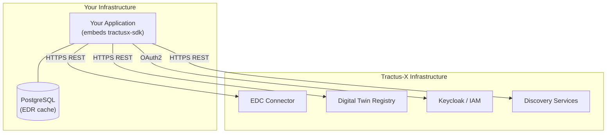

<!--

Eclipse Tractus-X - Software Development KIT

Copyright (c) 2026 LKS Next
Copyright (c) 2026 Contributors to the Eclipse Foundation

See the NOTICE file(s) distributed with this work for additional
information regarding copyright ownership.

This work is made available under the terms of the
Creative Commons Attribution 4.0 International (CC-BY-4.0) license,
which is available at
https://creativecommons.org/licenses/by/4.0/legalcode.

SPDX-License-Identifier: CC-BY-4.0

-->

# Production Deployment

This page covers what operators need to do to run applications built on the Eclipse Tractus-X SDK in a production environment.

## SDK Deployment Model

The SDK is a **library** — it runs inside the process of the consuming application. There are no SDK-owned servers, ports, or containers to manage.



For deployable microservices built on the SDK, see [tractusx-sdk-services](https://github.com/eclipse-tractusx/tractusx-sdk-services), which ships Docker images and Helm charts.

## Production Checklist

| Item | Requirement |
|------|-------------|
| **Authentication** | Use `OAuth2Manager` with Keycloak — never static API keys |
| **Connection manager** | Use `PostgresConnectionManager` for multi-process or containerized deployments |
| **Transport security** | All EDC, DTR, and IAM URLs must use `https://` |
| **Secrets** | All credentials injected via environment variables or a secrets manager |
| **Logging** | Set `verbose=False`; configure log level to `INFO` or `WARNING` in production |
| **Protocol version** | Use `dataspace_version="saturn"` for new deployments targeting EDC 0.11.x+ |
| **Dependency pinning** | Pin `tractusx-sdk` to a specific version in `requirements.txt` / `pyproject.toml` |

## Connection Manager Selection

### Single-process applications

Use `MemoryConnectionManager` (default). The EDR cache lives in RAM and is fast.

```python
import os
from tractusx_sdk.dataspace.services.connector.service_factory import ServiceFactory

# Default — no explicit manager needed
service = ServiceFactory.get_connector_consumer_service(
    dataspace_version="saturn",
    base_url=os.environ["EDC_BASE_URL"],
    dma_path=os.environ["EDC_DMA_PATH"],
    headers=headers,
)
```

### Multi-process / containerized applications

Use `PostgresConnectionManager` so all processes share the same EDR state. Without this, each process builds its own in-memory cache, causing redundant contract negotiations and potential race conditions.

```python
import os
from sqlmodel import create_engine
from tractusx_sdk.dataspace.managers.connection.database import PostgresConnectionManager
from tractusx_sdk.dataspace.services.connector.service_factory import ServiceFactory

engine = create_engine(os.environ["DATABASE_URL"])
manager = PostgresConnectionManager(engine=engine, table_name="edr_connections")

service = ServiceFactory.get_connector_consumer_service(
    dataspace_version="saturn",
    base_url=os.environ["EDC_BASE_URL"],
    dma_path=os.environ["EDC_DMA_PATH"],
    headers=headers,
    connection_manager=manager,
)
```

The `edr_connections` table is created automatically the first time the manager is used.

### Single-process with restart durability

Use `FileSystemConnectionManager` to persist the EDR cache across restarts without requiring a database.

```python
from tractusx_sdk.dataspace.managers.connection.file_system import FileSystemConnectionManager

manager = FileSystemConnectionManager(
    path="/var/data/edr_connections.json",
    persist_interval=30,
)
```

!!! warning
    `FileSystemConnectionManager` is not safe for concurrent access from multiple processes. Use `PostgresConnectionManager` for multi-process deployments.

## Scaling Considerations

| Scenario | Recommended manager | Notes |
|----------|-------------------|-------|
| Single container, stateless restarts acceptable | `MemoryConnectionManager` | Fastest; re-negotiates on each restart |
| Single container, state must survive restarts | `FileSystemConnectionManager` | Mount a persistent volume for the JSON file |
| Multiple replicas / horizontal scaling | `PostgresConnectionManager` | All replicas share one database |
| Serverless / ephemeral functions | `MemoryConnectionManager` | Each invocation negotiates fresh; acceptable for short-lived workloads |

## Monitoring the Application

The SDK itself does not expose metrics endpoints. Monitoring is the responsibility of the consuming application. Recommended approach:

1. **Structured logging** — configure the SDK logger to emit JSON-structured logs; ingest into your observability stack (ELK, Loki, etc.)
2. **Health/readiness probes** — see [Health Checks](health-checks.md) for how to expose EDC connector health via the SDK
3. **Database metrics** — monitor the `edr_connections` PostgreSQL table size and age if using `PostgresConnectionManager`

## NOTICE

This work is licensed under the [CC-BY-4.0](https://creativecommons.org/licenses/by/4.0/legalcode).

- SPDX-License-Identifier: CC-BY-4.0
- SPDX-FileCopyrightText: 2026 Contributors to the Eclipse Foundation
- SPDX-FileCopyrightText: 2026 LKS Next
- Source URL: [https://github.com/eclipse-tractusx/tractusx-sdk](https://github.com/eclipse-tractusx/tractusx-sdk)
