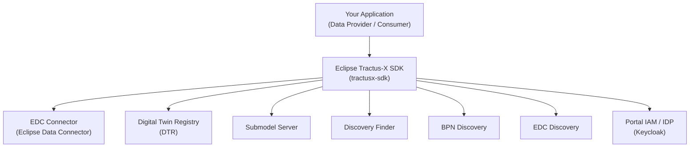
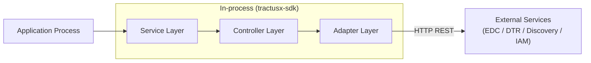

<!--

Eclipse Tractus-X - Software Development KIT

Copyright (c) 2026 LKS Next
Copyright (c) 2026 Contributors to the Eclipse Foundation

See the NOTICE file(s) distributed with this work for additional
information regarding copyright ownership.

This work is made available under the terms of the
Creative Commons Attribution 4.0 International (CC-BY-4.0) license,
which is available at
https://creativecommons.org/licenses/by/4.0/legalcode.

SPDX-License-Identifier: CC-BY-4.0

-->

# 3. System Scope and Context

## Business Context

The Eclipse Tractus-X SDK sits between consuming applications and the Eclipse Tractus-X infrastructure services. It abstracts all low-level protocol details so that application developers interact only with high-level, Pythonic APIs.

## External Interfaces

| External System | Communication | SDK Component |
|----------------|--------------|---------------|
| **EDC Connector** (DMA / Dataplane) | HTTP REST | `dataspace.adapters.connector`, `dataspace.services.connector` |
| **Digital Twin Registry** (DTR) | HTTP REST (AAS 3.0) | `industry.services.aas_service`, `industry.adapters` |
| **Submodel Server** | HTTP REST | `industry.adapters.submodel_adapters` |
| **Discovery Finder** | HTTP REST | `dataspace.services.discovery.discovery_finder_service` |
| **BPN Discovery** | HTTP REST | `industry.services.discovery` |
| **EDC Discovery** | HTTP REST | `dataspace.services.discovery.connector_discovery_service` |
| **Portal IAM / IDP** | OAuth2 / Token endpoint | `dataspace.managers.OAuth2Manager` |

## Technical Context

The SDK is distributed as a Python package on [PyPI](https://pypi.org/project/tractusx-sdk/). Consuming applications add it as a dependency and call its APIs directly in-process. There are no network hops between the application and the SDK — all HTTP communication happens from within the SDK on behalf of the calling application.

## System Boundaries

**Inside the SDK:**

- Service facades (`ServiceFactory`, `AasService`, discovery services)
- Multi-version controllers and adapters for EDC
- Authentication managers (OAuth2, API Key)
- In-memory connection cache
- Data models and schemas (Pydantic)
- Utility tools (HTTP tools, validators)

**Outside the SDK (not in scope):**

- Deployment infrastructure (EDC, DTR, Submodel Server deployments)
- Persistence / databases — the consuming application is responsible
- Business logic specific to a single use case
- Microservices wrapping the SDK (see [tractusx-sdk-services](https://github.com/eclipse-tractusx/tractusx-sdk-services))

## NOTICE

This work is licensed under the [CC-BY-4.0](https://creativecommons.org/licenses/by/4.0/legalcode).

- SPDX-License-Identifier: CC-BY-4.0
- SPDX-FileCopyrightText: 2026 Contributors to the Eclipse Foundation
- SPDX-FileCopyrightText: 2026 LKS Next
- Source URL: [https://github.com/eclipse-tractusx/tractusx-sdk](https://github.com/eclipse-tractusx/tractusx-sdk)
