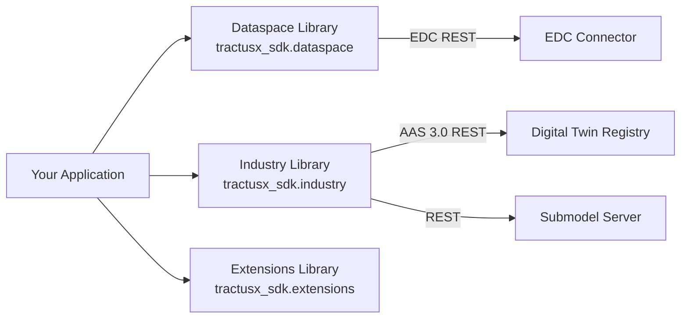
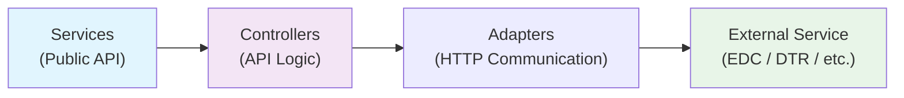

<!--

Eclipse Tractus-X - Software Development KIT

Copyright (c) 2026 LKS Next
Copyright (c) 2026 Contributors to the Eclipse Foundation

See the NOTICE file(s) distributed with this work for additional
information regarding copyright ownership.

This work is made available under the terms of the
Creative Commons Attribution 4.0 International (CC-BY-4.0) license,
which is available at
https://creativecommons.org/licenses/by/4.0/legalcode.

SPDX-License-Identifier: CC-BY-4.0

-->

# 5. Building Block View

## Level 1 — System Decomposition

The SDK is decomposed into three top-level libraries, each independently usable:



| Library | Responsibility |
|---------|---------------|
| `tractusx_sdk.dataspace` | Core EDC connector integration, discovery services, contract negotiation, data transfer |
| `tractusx_sdk.industry` | Digital Twin Registry (AAS 3.0), Submodel Server, BPN Discovery |
| `tractusx_sdk.extensions` | Semantic model processing (SAMM → JSON-LD), custom use-case extensions |

## Level 2 — Internal Layer Structure

All three libraries follow the same internal layer pattern:



### Dataspace Library (`tractusx_sdk.dataspace`)

```
tractusx_sdk/dataspace/
├── adapters/          # Raw HTTP communication with EDC
│   └── connector/
│       ├── jupiter/   # EDC v0.8.x–v0.10.x adapters
│       └── saturn/    # EDC v0.11.x adapters (DSP 2025-1)
├── controllers/       # EDC API request logic per version
│   └── connector/
│       ├── jupiter/
│       └── saturn/
├── managers/          # Authentication & connection lifecycle
│   └── connection/    # In-memory EDR connection cache
├── models/            # Pydantic data models
│   ├── connection/
│   └── connector/
├── services/          # Public service API
│   ├── connector/     # ServiceFactory, Consumer/Provider services
│   └── discovery/     # DiscoveryFinder, ConnectorDiscovery
└── tools/             # HttpTools, utility helpers
```

**Key public components:**

| Component | Description |
|-----------|-------------|
| `ServiceFactory` | Creates version-specific connector service instances |
| `ConnectorConsumerService` | High-level API for catalog queries, contract negotiation, EDR retrieval |
| `ConnectorProviderService` | High-level API for asset, policy, contract definition management |
| `DiscoveryFinderService` | Resolves BPN → EDC endpoint via the Discovery Finder |
| `ConnectorDiscoveryService` | Resolves BPN → connector URL via the EDC Discovery service |
| `OAuth2Manager` | Manages OAuth2 token lifecycle (Keycloak) |
| `AuthManager` | Simple API-key-based authentication |

### Industry Library (`tractusx_sdk.industry`)

```
tractusx_sdk/industry/
├── adapters/
│   ├── submodel_adapter.py            # Base submodel HTTP adapter
│   ├── submodel_adapter_factory.py    # Creates submodel adapters
│   └── submodel_adapters/             # Concrete implementations
├── managers/                          # AAS configuration management
├── models/
│   └── aas/                           # AAS 3.0 Pydantic models (v3)
├── services/
│   ├── aas_service.py                 # DTR CRUD operations
│   └── discovery/                     # BPN Discovery service
└── tools/                             # Utility helpers
```

**Key public components:**

| Component | Description |
|-----------|-------------|
| `AasService` | Shell descriptor and submodel descriptor CRUD against DTR |
| `SubmodelAdapterFactory` | Creates the correct HTTP adapter for a given submodel server type |
| `BpnDiscoveryService` | Resolves asset keys → BPN numbers via BPN Discovery |

### Extensions Library (`tractusx_sdk.extensions`)

```
tractusx_sdk/extensions/
└── semantics/
    └── schema_to_context_translator.py  # SAMM → JSON-LD converter
```

**Key public components:**

| Component | Description |
|-----------|-------------|
| `SammSchemaContextTranslator` | Converts SAMM aspect model schemas to JSON-LD context documents |

## NOTICE

This work is licensed under the [CC-BY-4.0](https://creativecommons.org/licenses/by/4.0/legalcode).

- SPDX-License-Identifier: CC-BY-4.0
- SPDX-FileCopyrightText: 2026 Contributors to the Eclipse Foundation
- SPDX-FileCopyrightText: 2026 LKS Next
- Source URL: [https://github.com/eclipse-tractusx/tractusx-sdk](https://github.com/eclipse-tractusx/tractusx-sdk)
