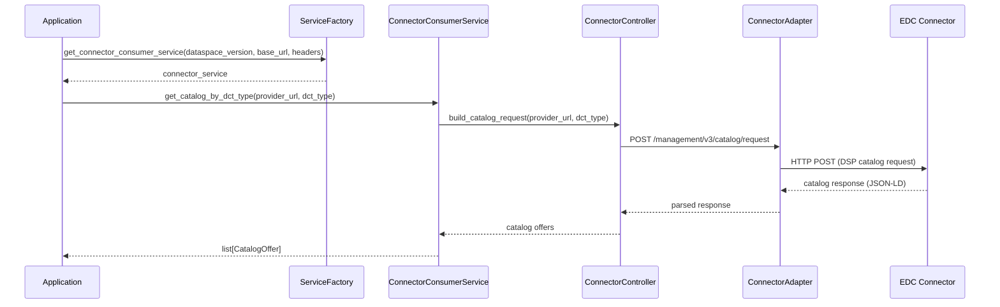
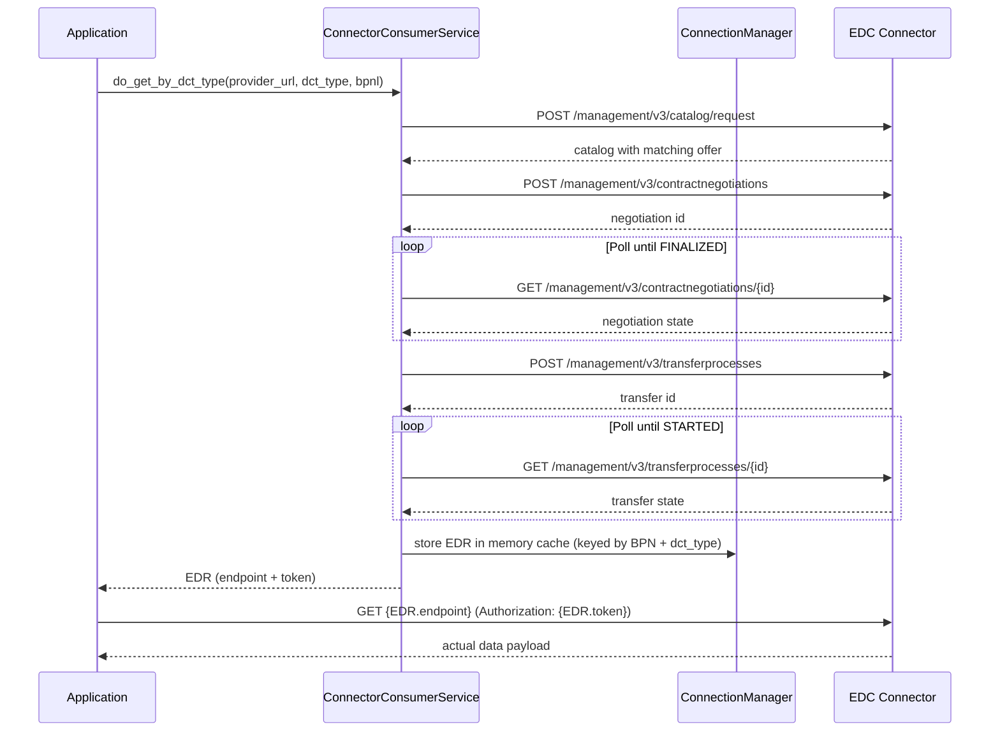
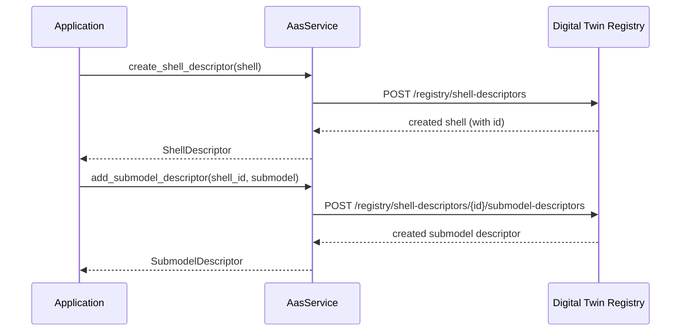
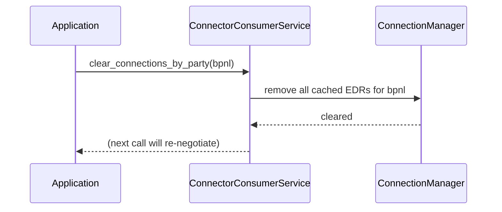

<!--

Eclipse Tractus-X - Software Development KIT

Copyright (c) 2026 LKS Next
Copyright (c) 2026 Contributors to the Eclipse Foundation

See the NOTICE file(s) distributed with this work for additional
information regarding copyright ownership.

This work is made available under the terms of the
Creative Commons Attribution 4.0 International (CC-BY-4.0) license,
which is available at
https://creativecommons.org/licenses/by/4.0/legalcode.

SPDX-License-Identifier: CC-BY-4.0

-->

# 6. Runtime View

## Scenario 1: Catalog Discovery

An application queries an EDC connector to discover available offers by `dct:type`.

## Scenario 2: Contract Negotiation and EDR Retrieval

An application negotiates a contract and retrieves the EDR (Endpoint Data Reference) to access the actual data.

## Scenario 3: Digital Twin Registration

An application registers a new shell descriptor and submodel descriptor in the DTR.

## Scenario 4: EDR Cache Eviction (Per Party)

When a Business Partner connection needs to be reset (e.g., token expiry or configuration change), the in-memory cache for that party is cleared.

## NOTICE

This work is licensed under the [CC-BY-4.0](https://creativecommons.org/licenses/by/4.0/legalcode).

- SPDX-License-Identifier: CC-BY-4.0
- SPDX-FileCopyrightText: 2026 Contributors to the Eclipse Foundation
- SPDX-FileCopyrightText: 2026 LKS Next
- Source URL: [https://github.com/eclipse-tractusx/tractusx-sdk](https://github.com/eclipse-tractusx/tractusx-sdk)
