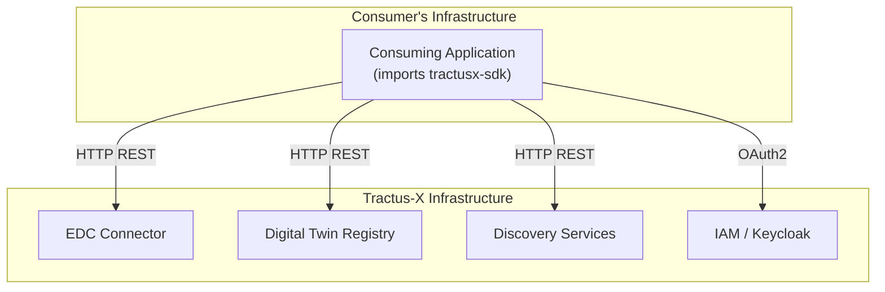

<!--

Eclipse Tractus-X - Software Development KIT

Copyright (c) 2026 LKS Next
Copyright (c) 2026 Contributors to the Eclipse Foundation

See the NOTICE file(s) distributed with this work for additional
information regarding copyright ownership.

This work is made available under the terms of the
Creative Commons Attribution 4.0 International (CC-BY-4.0) license,
which is available at
https://creativecommons.org/licenses/by/4.0/legalcode.

SPDX-License-Identifier: CC-BY-4.0

-->

# 7. Deployment View

## Overview

The Eclipse Tractus-X SDK is a **pure Python library**. It has no deployment artifacts of its own — no Docker images, no Helm charts, no Kubernetes manifests.

Consumers install it as a standard Python package:

```bash
pip install tractusx-sdk
```

Or via Poetry:

```bash
poetry add tractusx-sdk
```

## Distribution

| Artifact | Location |
|---------|----------|
| PyPI package | [https://pypi.org/project/tractusx-sdk/](https://pypi.org/project/tractusx-sdk/) |
| Source code | [https://github.com/eclipse-tractusx/tractusx-sdk](https://github.com/eclipse-tractusx/tractusx-sdk) |
| Release tags | GitHub Releases (e.g., `v0.8.0`) |

The package is published automatically to PyPI via the [release workflow](https://github.com/eclipse-tractusx/tractusx-sdk/blob/main/.github/workflows/release.yaml) when a version tag is pushed.

## Consuming Application Deployment

The SDK runs in-process inside the consuming application. The application developer is responsible for:

- Choosing a runtime environment (bare metal, container, serverless, etc.)
- Providing the required configuration (EDC URL, authentication credentials)
- Deploying and managing the EDC connector, DTR, and other Tractus-X infrastructure



## Microservices

Deployable microservices that wrap the SDK are maintained in the separate [tractusx-sdk-services](https://github.com/eclipse-tractusx/tractusx-sdk-services) repository. Those services do include Docker images, Helm charts, and deployment documentation. See [ADR-0004](../contributing/architectural-decisions/0004-tractusx-sdk-services.md).

## NOTICE

This work is licensed under the [CC-BY-4.0](https://creativecommons.org/licenses/by/4.0/legalcode).

- SPDX-License-Identifier: CC-BY-4.0
- SPDX-FileCopyrightText: 2026 Contributors to the Eclipse Foundation
- SPDX-FileCopyrightText: 2026 LKS Next
- Source URL: [https://github.com/eclipse-tractusx/tractusx-sdk](https://github.com/eclipse-tractusx/tractusx-sdk)
