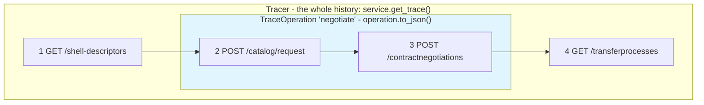
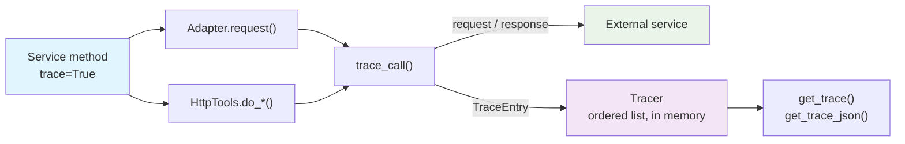

<!--

Eclipse Tractus-X - Software Development KIT

Copyright (c) 2026 Contributors to the Eclipse Foundation

See the NOTICE file(s) distributed with this work for additional
information regarding copyright ownership.

This work is made available under the terms of the
Creative Commons Attribution 4.0 International (CC-BY-4.0) license,
which is available at
https://creativecommons.org/licenses/by/4.0/legalcode.

SPDX-License-Identifier: CC-BY-4.0

-->

# Request Tracing

Every SDK service, adapter and factory accepts an **optional `trace` flag**, exactly like the
existing `verbose` flag. When it is enabled, the SDK stores every request sent to (and every
response received from) the external services contacted while its methods are executed -
connectors, digital twin registries, discovery services, submodel servers, notification
endpoints - and hands it back as **JSON you can parse**.

Tracing is completely opt-in: with the default `trace=False` nothing is recorded and the
requests are performed exactly as they were before, without any additional processing.

## Enabling the trace

```python
from tractusx_sdk.dataspace.services.connector import ServiceFactory

connector = ServiceFactory.get_connector_consumer_service(
    dataspace_version="jupiter",
    base_url="https://connector.example.com",
    dma_path="/management",
    headers={"X-Api-Key": "<api-key>"},
    trace=True,          # <-- records every request/response
)

connector.do_get(
    counter_party_id="BPNL000000000000",
    counter_party_address="https://provider.example.com/api/v1/dsp",
    filter_expression=[...],
)

print(connector.get_trace_json())   # JSON string, ready to be parsed
```

## Reading the trace

| Method | Returns |
|--------|---------|
| `get_trace()` | `list[dict]` — one entry per call, in execution order |
| `get_trace_entries()` | `list[TraceEntry]` — the same calls, as objects with typed accessors |
| `get_trace_dict()` | `dict` — the entries plus the trace metadata |
| `get_trace_json(indent=2)` | `str` — the same dictionary, serialized as JSON |
| `trace_operation(name)` | Groups the calls of a `with` block, on their own (see below) |
| `clear_trace()` | Removes the recorded entries |
| `enable_trace()` / `disable_trace()` | Turns the recording on/off at runtime |
| `set_tracer(tracer)` | Records into an existing `Tracer`, sharing it with other services |
| `trace_enabled` | `bool` — whether the service is currently recording |
| `tracer` | The `Tracer` used by the service, or `None` |

This is one catalog request, as `get_trace_json()` returns it:

```json
{
  "name": "ConnectorConsumerService",
  "enabled": true,
  "created_at": "2026-08-18T15:03:27.248323+00:00",
  "count": 1,
  "entries": [
    {
      "id": "04640490b4df40998055b4421a65911e",
      "index": 1,
      "context": "CatalogController.get_catalog",
      "operation": null,
      "operation_id": null,
      "started_at": "2026-08-18T15:03:27.248796+00:00",
      "finished_at": "2026-08-18T15:03:27.300757+00:00",
      "duration_ms": 51.945,
      "request": {
        "method": "POST",
        "url": "https://connector.example.com/management/v3/catalog/request",
        "headers": {
          "User-Agent": "python-requests/2.32.4",
          "Accept": "*/*",
          "X-Api-Key": "***"
        },
        "params": null,
        "body": {
          "@context": {
            "edc": "https://w3id.org/edc/v0.0.1/ns/",
            "odrl": "http://www.w3.org/ns/odrl/2/",
            "dct": "https://purl.org/dc/terms/"
          },
          "@type": "CatalogRequest",
          "counterPartyAddress": "https://provider.example.com/api/v1/dsp",
          "counterPartyId": "BPNL00000003AYRE",
          "protocol": "dataspace-protocol-http",
          "additionalScopes": [],
          "querySpec": {}
        }
      },
      "response": {
        "status_code": 200,
        "reason": "OK",
        "content_type": "application/json",
        "headers": {
          "Content-Type": "application/json",
          "Server": "Jetty(12.0.x)"
        },
        "elapsed_ms": 49.7,
        "body": {
          "@id": "1e1b8b3a",
          "@type": "dcat:Catalog",
          "dcat:dataset": [
            {
              "@id": "urn:uuid:9d1a-part-data",
              "@type": "dcat:Dataset",
              "odrl:hasPolicy": { "@id": "policy-1" },
              "dct:type": { "@id": "https://w3id.org/catenax/taxonomy#DigitalTwinRegistry" }
            }
          ],
          "dspace:participantId": "BPNL00000003AYRE"
        }
      },
      "error": null
    }
  ]
}
```

`context` is the SDK method that performed the call. Payloads the SDK serializes before
sending them (the connector models are sent as JSON strings) are recorded as objects, so the
whole trace can be navigated as JSON.

JSON bodies are recorded **in full and as JSON** - never as an escaped string - so a trace can
be parsed and queried directly. `max_body_chars` caps the size of a recorded body when that is
not wanted (large catalogs, submodel payloads): the body then keeps its structure and the parts
that did not fit are replaced by a `...[truncated N items]` / `...[truncated N keys]` marker,
instead of the body being collapsed into a string.

Not every response is JSON, and every one is recorded: `content_type` says what came back,
non-JSON textual bodies (an HTML error page, plain text) are stored as they are, and binary
bodies (a PDF or ZIP served by a submodel server) are stored base64 encoded:

```json
"response": {
  "status_code": 200,
  "reason": "OK",
  "content_type": "application/pdf",
  "body": { "encoding": "base64", "length": 48211, "data": "JVBERi0xLjcK..." }
}
```

When the call never gets an answer, `response` stays `null` and `error` carries what happened:

```json
{
  "id": "f77bfaf8d13b4d9f9c0a4b282ee62d65",
  "index": 1,
  "context": "CatalogController.get_catalog",
  "operation": null,
  "operation_id": null,
  "started_at": "2026-08-18T15:03:50.806261+00:00",
  "finished_at": "2026-08-18T15:03:50.836295+00:00",
  "duration_ms": 30012.4,
  "request": {
    "method": "POST",
    "url": "https://connector.example.com/management/v3/catalog/request",
    "headers": { "X-Api-Key": "***" },
    "params": null,
    "body": { "@type": "CatalogRequest", "counterPartyId": "BPNL00000003AYRE" }
  },
  "response": null,
  "error": {
    "type": "ConnectTimeout",
    "message": "HTTPSConnectionPool(host='provider.example.com', port=443): Read timed out. (connect timeout=30)"
  }
}
```

## The data model

A `Tracer` keeps an **ordered list of entries in memory**, one per call, appended as the
requests are sent. Nothing is written to disk, and nothing leaves the process. The list is
capped at `max_entries` (1000 by default): once full, the oldest entries are dropped. Bodies
are recorded in full, so the memory a long-lived trace takes follows the size of the payloads
exchanged; `max_body_chars` bounds it when that matters (`Tracer(max_entries=200,
max_body_chars=2000)` keeps a trace under about 1.5 MB). Access is guarded by a lock, so one
tracer can be shared by several threads.

```
Tracer
├── name / created_at / enabled           the trace metadata
├── max_entries / capture_* / redact_*    what is recorded
└── entries: [TraceEntry, TraceEntry, ...]  the calls, in execution order
```

Each `TraceEntry` is a dataclass:

| Field | Type | Description |
|-------|------|-------------|
| `id` | `str` | Unique identifier of the entry |
| `index` | `int` | Position in the trace, starting at 1 |
| `context` | `str` or `None` | The SDK method that performed the call |
| `operation` | `str` or `None` | Name of the operation the call belongs to (see below) |
| `operation_id` | `str` or `None` | Generated id of that operation, unique per execution |
| `started_at` / `finished_at` | `str` | ISO-8601 UTC timestamps |
| `duration_ms` | `float` or `None` | Time spent in the call |
| `request` | `dict` | `method`, `url`, `headers`, `params`, `body` |
| `response` | `dict` or `None` | `status_code`, `reason`, `content_type`, `headers`, `elapsed_ms`, `body` |
| `error` | `dict` or `None` | `type` and `message`, when the call raised |
| `status_code` | `int` or `None` | Shortcut for `response["status_code"]` |
| `failed` | `bool` | The call raised, or returned a 4xx/5xx |

The entry is created **before** the request is sent, and completed once the response (or the
error) is known, so a call that never comes back is still in the trace, with `response` and
`finished_at` left empty.

## Getting the calls, and filtering them

The trace is **kept as objects** (`TraceEntry` dataclasses); the dictionaries and the JSON
are produced on demand. Both flavours take the same filters - pick whichever fits, dicts to
serialize, objects to navigate:

```python
service.get_trace()                     # every call, as dictionaries
service.get_trace(failed=True)          # only what raised or returned a 4xx/5xx
service.get_trace(method="POST")
service.get_trace(url="/catalog/request")

service.get_trace_entries()             # every call, as TraceEntry objects
for entry in service.get_trace_entries(failed=True):
    print(entry.method, entry.url, entry.status_code, entry.duration_ms)

tracer.entries                          # every call, as TraceEntry objects
tracer.failures                         # shortcut for filter(failed=True)
tracer.filter(status_code=[200, 201], min_duration_ms=500)
tracer.to_list(method=["GET", "POST"])  # filtered, as dictionaries
len(tracer)                             # number of recorded calls

for entry in tracer:                    # iterable, in execution order
    print(entry.method, entry.url, entry.status_code, entry.duration_ms)
```

`filter()` accepts the following criteria, combined with an AND:

| Parameter | Matches |
|-----------|---------|
| `method` | An HTTP method, or a list of them (case insensitive) |
| `status_code` | A status code, or a list of them |
| `url` | Substring of the URL (case insensitive) |
| `context` | Substring of the context (case insensitive) |
| `operation` | Substring of the operation name (case insensitive) |
| `operation_id` | Exactly one operation execution |
| `failed` | `True` keeps the failures, `False` keeps the successful calls |
| `min_duration_ms` | Calls slower than the given duration |

```python
# The slow, failing catalog requests of a business flow
for entry in tracer.filter(url="/catalog/request", failed=True, min_duration_ms=1000):
    print(entry.index, entry.context, entry.status_code, entry.duration_ms, entry.error)
```

## Services take the flag, adapters take the tracer

`trace` is a `bool` and lives where `verbose` lives: on the **services** and their factories.
Every SDK service inherits it from `BaseService`, which carries the tracing capability and
hands the tracer down to everything the service is built upon - its adapters, sessions,
controllers and sub-services are discovered automatically.

The **adapters** below them (`Adapter`, `BaseDmaAdapter`, `HttpSubmodelAdapter`) have no flag
of their own - they take a `tracer` parameter, which is either a `Tracer` or `None`, and the
service hands them its own tracer:

```python
from tractusx_sdk.dataspace.tools import Tracer
from tractusx_sdk.industry.adapters.submodel_adapters.http_submodel_adapter import HttpSubmodelAdapter

adapter = HttpSubmodelAdapter(base_url=..., auth_type="none", tracer=Tracer())
```

## Sharing one trace between services

`set_tracer()` makes several services record into the same `Tracer`, which puts a complete
business flow into one single, ordered trace:

```python
from tractusx_sdk.dataspace.tools import Tracer
from tractusx_sdk.industry.services.aas_service import AasService

tracer = Tracer(name="get-part-data")

registry = AasService(base_url=..., base_lookup_url=..., api_path="/api/v3")
connector = ServiceFactory.get_connector_consumer_service(...)

registry.set_tracer(tracer)
connector.set_tracer(tracer)

registry.get_all_asset_administration_shell_descriptors(bpn="BPNL000000000000")
connector.do_get(...)

print(tracer.to_json())     # both services, in one trace
```

`set_tracer()` walks the whole object graph, so calling it on a connector service also
covers its adapter, its controllers and its consumer/provider services. The
`ServiceFactory.get_connector_service()` factory does exactly this: the connector service and
the consumer/provider services it is composed of share one single trace.

## Configuring what is recorded

The `Tracer` constructor controls the content of the trace:

| Option | Default | Description |
|--------|---------|-------------|
| `enabled` | `True` | Records the calls |
| `name` | `None` | Name of the trace |
| `max_entries` | `1000` | Maximum number of entries kept (the oldest are dropped) |
| `capture_bodies` | `True` | Records the request/response bodies |
| `capture_headers` | `True` | Records the request/response headers |
| `max_body_chars` | `None` | Maximum size of a recorded body (`None` records them in full) |
| `redact_headers` | `True` | Masks the sensitive headers |
| `redacted_headers` | `Authorization`, `X-Api-Key`, `Cookie`, ... | Header names to mask |

```python
tracer = Tracer(capture_bodies=False, max_entries=100)
connector = ServiceFactory.get_connector_provider_service(...)
connector.set_tracer(tracer)
```

!!! warning "Traces may contain business data"
    Authentication headers are masked by default, but the request and response **bodies are
    not**. Treat a trace like the payloads it contains before logging or forwarding it, and
    use `capture_bodies=False` when only the call sequence matters.

## Tracing one operation

A long-lived instance executes many methods over its lifetime, and its trace grows
accordingly. To get hold of the requests/responses of **one specific execution**, wrap it in
an operation - a `with` block whose calls are grouped, and handed back, on their own:

```python
with connector.trace_operation("negotiate-part-data") as operation:
    connector.do_get(...)

print(operation.to_json())      # only the calls of the block
operation.entries               # the same calls, as TraceEntry objects
operation.failed                # True when any call raised or returned a 4xx/5xx
```

`trace_operation()` works with or without the `trace` flag:

- **With `trace=True`**, the calls also accumulate in the service's own trace, stamped with
  the operation's name and its generated id, so a specific execution can be found again
  later - even after many others:

  ```python
  connector.get_trace(operation="negotiate-part-data")    # every execution with that name
  connector.get_trace(operation_id=operation.id)          # exactly that one execution
  ```

- **Without the flag**, a temporary tracer records the block: the operation hands back its
  calls, and nothing is retained once it is consumed. Tracing stays ephemeral, and the
  memory is released with the operation.

Every execution gets its own generated id, so repeated runs of an equally named operation
stay apart. Operations nest: an outer block also contains the calls of the blocks inside
it, each entry being stamped with the innermost one.

An operation is a **view over the trace, not a second copy**: the entries stay in the
tracer's single ordered list, and the ones recorded inside the block also belong to the
operation:



Calls 2 and 3 were made inside `with service.trace_operation("negotiate")`: the operation
hands them back on their own, while the trace keeps all four, in order - and
`get_trace(operation="negotiate")` finds the two of them again later. The active operation follows the
execution context - `asyncio` tasks inherit it, threads spawned by hand do not (their calls
are still traced, they are just not grouped).

The same block form works directly on a `Tracer`, for a flow spanning several services (or
helper code that belongs to none):

```python
from tractusx_sdk.dataspace.tools import Tracer

tracer = Tracer()
with tracer.activate("get-part-data") as operation:
    registry.get_all_asset_administration_shell_descriptors(...)
    connector.do_get(...)       # any SDK call made here is traced

print(operation.to_json())
```

An operation serializes with its own metadata:

```json
{
  "id": "3d9c9f7a0f014f70a9ce13d2f9a7b3f1",
  "name": "negotiate-part-data",
  "started_at": "2026-08-18T15:03:27.248323+00:00",
  "finished_at": "2026-08-18T15:03:29.101457+00:00",
  "failed": false,
  "count": 2,
  "entries": [ ... ]
}
```

## How it works

There are only two places where the SDK talks to an external service, and both are
instrumented, so enabling `trace` covers every request:

1. **The adapters** - every call a service makes through its controllers goes through
   `Adapter.request()`, which records the call whenever the adapter has a tracer.
2. **`HttpTools`** - the calls a service performs on its own (the connector dataplane, the
   discovery services, the notification endpoints) go through `HttpTools.do_*`, which records
   the call when the service hands over its tracer, or when the tracer is bound to the
   session being used.



With the default `trace=False` there is no tracer to resolve, `trace_call()` takes its fast
path, and the request goes straight out, unchanged.

Nothing else has to be instrumented: a service that is given a tracer traces everything it
does, no matter which of the two paths a particular call takes.

## What is traced

| Component | Traced calls |
|-----------|--------------|
| Connector services (consumer, provider, connector) | Management API and dataplane calls |
| Connector adapters and controllers | Every DMA request |
| Discovery services (discovery finder, connector discovery, BPN discovery) | Every discovery request |
| `AasService` | Every Digital Twin Registry request |
| Notification services (industry and extension) | Connector calls and notification deliveries |
| `HttpSubmodelAdapter` | Every submodel server request |

Not part of the trace: the non-HTTP submodel adapters (file system, S3), the Keycloak token
requests of the `OAuth2Manager`, and the TCK connector helpers, which use the `requests`
library directly and keep their own verbose logging.
