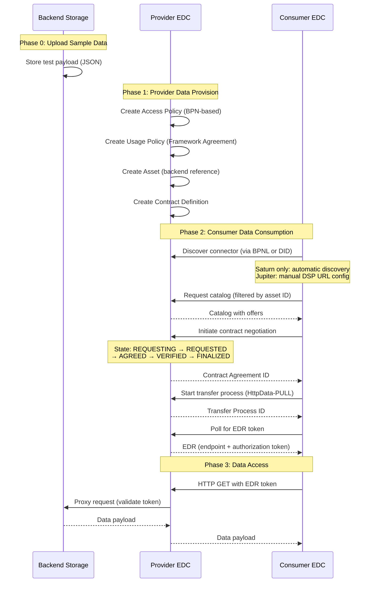

<!--
Eclipse Tractus-X - Tractus-X SDK

Copyright (c) 2026 Catena-X Automotive Network e.V.
Copyright (c) 2026 Contributors to the Eclipse Foundation

See the NOTICE file(s) distributed with this work for additional
information regarding copyright ownership.

This program and the accompanying materials are made available under the
terms of the Apache License, Version 2.0 which is available at
https://www.apache.org/licenses/LICENSE-2.0.

SPDX-License-Identifier: Apache-2.0
-->

# Connector TCK

The **Connector TCK** validates that [Eclipse Tractus-X EDC](https://github.com/eclipse-tractusx/tractusx-edc) implementations work correctly with the Tractus-X SDK. It tests the complete data exchange flow using the [simple-data-backend](https://github.com/eclipse-tractusx/tractus-x-umbrella/tree/main/simple-data-backend) as a storage backend.

## Demo

<video controls width="100%" style="border-radius: 8px; margin: 1rem 0;">
  <source src="../../assets/videos/tck-demo.mov" type="video/mp4">
  Your browser does not support the video tag. Download the demo:
  <a href="../../assets/videos/tck-demo.mov">tck-demo.mov</a>
</video>

Two EDC protocol generations are covered:

| Protocol | EDC Versions | Identifier |
|----------|-------------|------------|
| **Jupiter** — Legacy DSP | 0.8.0 – 0.10.x | `dataspace-protocol-http` |
| **Saturn** — DSP 2025-1 | 0.11.x + | `dataspace-protocol-http:2025-1` |

## Test Scripts

Six scripts cover two protocol versions, two complexity levels, and two discovery modes:

| Script | Protocol | EDC Version | Discovery | Complexity |
|--------|----------|-------------|-----------|------------|
| `tck_e2e_saturn_0-11-X_detailed.py` | Saturn | 0.11.x+ | BPNL | Detailed |
| `tck_e2e_saturn_0-11-X_simple.py` | Saturn | 0.11.x+ | BPNL | Simple |
| `tck_e2e_saturn_0-11-X_detailed_did.py` | Saturn | 0.11.x+ | DID | Detailed |
| `tck_e2e_saturn_0-11-X_simple_did.py` | Saturn | 0.11.x+ | DID | Simple |
| `tck_e2e_jupiter_0-10-X_detailed.py` | Jupiter | 0.8.x–0.10.x | BPNL | Detailed |
| `tck_e2e_jupiter_0-10-X_simple.py` | Jupiter | 0.8.x–0.10.x | BPNL | Simple |

### Detailed vs. Simple

**Detailed tests** (`*_detailed.py`):

- Explicit control over every phase (provision, catalog, negotiate, transfer, access)
- Validates individual API responses at each step
- Comprehensive request/response logging
- Best for: debugging, learning the data flow, verifying specific behaviors

**Simple tests** (`*_simple.py`):

- Uses `do_get_with_bpnl()` — the entire consumer flow in a single SDK call
- Minimal code, maximum automation
- Best for: quick smoke tests, CI/CD integration, production usage patterns

## Test Flow

All TCK tests follow this standardized sequence:

## Prerequisites

Before running any TCK script, ensure the following are in place:

### 1. Two EDC Connectors (Provider and Consumer)

- [Tractus-X EDC](https://github.com/eclipse-tractusx/tractusx-edc) — Saturn: ≥ 0.11.x / Jupiter: 0.8.x–0.10.x
- Management API accessible with a valid API key from your machine
- Both connectors reachable over HTTP/HTTPS

### 2. Backend Storage Service

- Recommended: [simple-data-backend](https://github.com/eclipse-tractusx/tractus-x-umbrella/tree/main/simple-data-backend)
- HTTP endpoint for storing and retrieving test data
- Reachable from the Provider Data Plane

### 3. Network Connectivity

| Source | Destination |
|--------|-------------|
| Test machine | Provider Control Plane (Management API) |
| Test machine | Consumer Control Plane (Management API) |
| Consumer EDC | Provider EDC (DSP protocol endpoint) |
| Provider Data Plane | Backend Storage |

### 4. Discovery Service (Saturn only)

- BPN-to-connector mapping registered
- Discovery Finder and BPN Discovery services operational

### 5. Dataspace Onboarding & Verifiable Credentials

Both Provider and Consumer must be onboarded in the Catena-X dataspace:

- Valid **BPN Verifiable Credentials** for both parties
- **Framework Agreement VCs** matching the usage policy (e.g., `Traceability:1.0`)
- EDC connectors configured with SSI/credential validation
- All VC claims must match the `leftOperand` values used in policies

!!! warning
    Without valid credentials, contract negotiations will be rejected even if the catalog is visible. If tests fail during negotiation (state stuck in `REQUESTING` or `TERMINATED`), verify that both parties have the required VCs.

## Next Steps

| Topic | Description |
|-------|-------------|
| [Configuration](configuration.md) | Set up `tck-config.yaml` for your environment |
| [Running Tests](running-tests.md) | CLI options, parallel execution, and manual testing |
| [CI/CD Integration](cicd-integration.md) | GitHub Actions workflows for Jupiter and Saturn protocols |
| [Interpreting Results](interpreting-results.md) | Log format, PASS/FAIL criteria, and troubleshooting guide |
| [API Reference](api-reference.md) | Extension module layout, all classes and helpers, custom test authoring |

## Protocol Differences

| Aspect | Jupiter (0.8.x–0.10.x) | Saturn (0.11.x+) |
|--------|------------------------|-------------------|
| **DSP Protocol** | `dataspace-protocol-http` | `dataspace-protocol-http:2025-1` |
| **ODRL Context** | `https://w3id.org/tractusx/auth/v1.0.0` `http://www.w3.org/ns/odrl.jsonld` | `https://w3id.org/catenax/2025/9/policy/odrl.jsonld` `https://w3id.org/catenax/2025/9/policy/context.jsonld` |
| **Catalog Keys** | Prefixed (`dcat:dataset`, `odrl:hasPolicy`) | Unprefixed or both |
| **Discovery** | Manual BPNL→DSP URL mapping | Required (BPNL→DID→DSP URL) |

Use Jupiter for EDC v0.8.x–0.10.x, Saturn for v0.11.x+. Run both to verify backward compatibility during a migration.

## NOTICE

This work is licensed under the [CC-BY-4.0](https://creativecommons.org/licenses/by/4.0/legalcode).

- SPDX-License-Identifier: CC-BY-4.0
- SPDX-FileCopyrightText: 2025, 2026 Contributors to the Eclipse Foundation
- SPDX-FileCopyrightText: 2025, 2026 Catena-X Automotive Network e.V.
- SPDX-FileCopyrightText: 2025, 2026 LKS Next
- SPDX-FileCopyrightText: 2025, 2026 Mondragon Unibertsitatea
- Source URL: [https://github.com/eclipse-tractusx/tractusx-sdk](https://github.com/eclipse-tractusx/tractusx-sdk)
