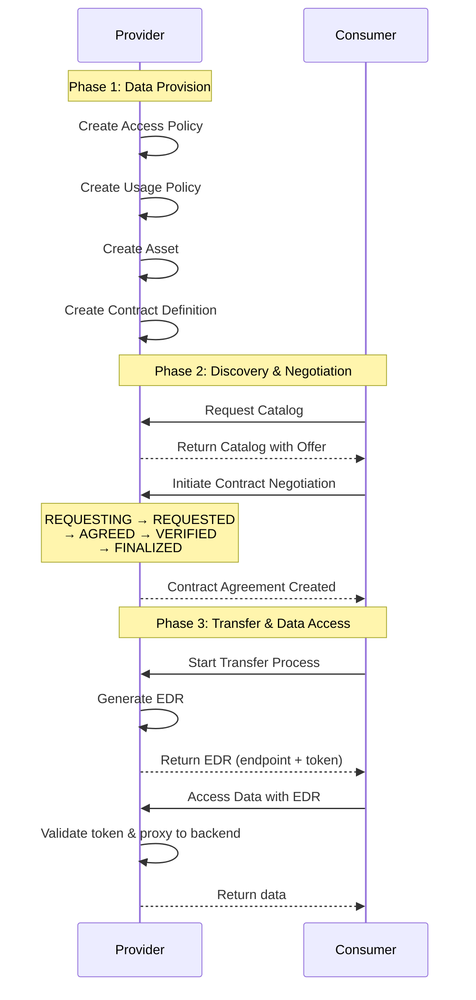

# Saturn Connector Examples

This directory contains comprehensive examples demonstrating the use of Saturn connector models and services for data exchange in the Tractus-X dataspace.

## Files Overview

### 1. `saturn_e2e_walkthrough.py`
**Purpose**: Demonstrates the complete Management API walkthrough using Saturn models.

**What it shows**:
- Creating Assets, Policies, Contract Definitions with model serialization
- Catalog requests and responses
- Contract negotiation flow
- Transfer process initiation
- Policy variations (BPN, Framework Agreement, Time-limited, etc.)
- ODRL context compliance

**How to run**:
```bash
python examples/dataspace/services/connector/saturn_e2e_walkthrough.py
```

**Use this when**: You want to understand the data structures and model serialization for Saturn/Tractus-X EDC v0.7.0+

---

### 2. `saturn_e2e_provision_consumption.py`
**Purpose**: Complete end-to-end data exchange using actual connector services (Provider and Consumer).

**What it shows**:
- **Phase 1: Provider Data Provision**
  - Initialize Provider connector service
  - Create Access Policy (BPN-based)
  - Create Usage Policy (Framework Agreement)
  - Create Asset (backend data source)
  - Create Contract Definition

- **Phase 2: Consumer Data Consumption**
  - Initialize Consumer connector service
  - Request catalog from Provider
  - Negotiate contract agreement
  - Initiate transfer process
  - Obtain EDR (Endpoint Data Reference)

- **Phase 3: Data Access**
  - Use EDR to access Provider's data
  - Make authenticated HTTP requests

**Configuration Required**:
```python
# Provider Connector
PROVIDER_CONNECTOR_CONFIG = {
    "base_url": "https://provider-edc.example.com",
    "api_key": "your-provider-api-key",
    "bpn": "BPNL000000000001",
    "dsp_url": "https://provider-edc.example.com/api/v1/dsp"
}

# Consumer Connector
CONSUMER_CONNECTOR_CONFIG = {
    "base_url": "https://consumer-edc.example.com",
    "api_key": "your-consumer-api-key",
    "bpn": "BPNL000000000002"
}

# Backend Data Source
BACKEND_CONFIG = {
    "base_url": "https://backend.example.com/api/data",
    "oauth2_token_url": "https://auth.example.com/token",
    "oauth2_client_id": "client-id",
    "oauth2_client_secret_key": "vault-key"
}
```

**How to run**:
1. Update the PLACEHOLDER values in the configuration section
2. Uncomment the `main()` call at the bottom
3. Run:
```bash
python examples/dataspace/services/connector/saturn_e2e_provision_consumption.py
```

**Use this when**: You want to test the complete flow with real EDC connectors

---

## Prerequisites

### For Model Examples (saturn_e2e_walkthrough.py)
- Tractus-X SDK installed
- No external services required

### For Service Examples (saturn_e2e_provision_consumption.py)
- Two running EDC connectors (Provider and Consumer)
  - Tractus-X EDC v0.7.0+ recommended
  - Both must be accessible via HTTP/HTTPS
  - API keys configured for Management API

- Backend API (for Provider's data source)
  - OAuth2 authentication supported
  - Accessible from Provider's Data Plane

- Network connectivity between:
  - Your machine → Provider Control Plane (Management API)
  - Your machine → Consumer Control Plane (Management API)
  - Consumer EDC → Provider EDC (DSP protocol)
  - Provider Data Plane → Backend API

## Key Concepts Demonstrated

### 1. Saturn Models (Tractus-X EDC v0.7.0+)
- **ODRL Context Compliance**: Context at root level, not nested
- **Policy Type**: "Set" not "odrl:Set" when ODRL imported
- **JSON-LD Structure**: Proper semantic web standards
- **Dataspace Protocol**: dataspace-protocol-http:2025-1

### 2. Service Initialization Pattern
Based on [Industry Core Hub](https://github.com/eclipse-tractusx/industry-core-hub/blob/main/ichub-backend/connector.py):

```python
# Provider Service
provider_service = ServiceFactory.get_connector_provider_service(
    dataspace_version="saturn",
    base_url=PROVIDER_URL,
    dma_path="/management",
    headers={"X-Api-Key": API_KEY},
    verbose=True
)

# Consumer Service
consumer_service = ServiceFactory.get_connector_consumer_service(
    dataspace_version="saturn",
    base_url=CONSUMER_URL,
    dma_path="/management",
    headers={"X-Api-Key": API_KEY},
    connection_manager=connection_manager,  # Optional for EDR caching
    verbose=True
)
```

### 3. Complete Data Exchange Flow



## Policy Examples

### BPN-based Access Control
```python
provider_service.create_policy(
    policy_id="access-bpn",
    permissions=[{
        "action": "access",
        "constraint": {
            "leftOperand": "BusinessPartnerNumber",
            "operator": "eq",
            "rightOperand": "BPNL000000000002"
        }
    }]
)
```

### Framework Agreement Requirement
```python
provider_service.create_policy(
    policy_id="usage-framework",
    permissions=[{
        "action": "use",
        "constraint": {
            "and": [
                {"leftOperand": "Membership", "operator": "eq", "rightOperand": "active"},
                {"leftOperand": "FrameworkAgreement", "operator": "eq", "rightOperand": "DataExchangeGovernance:1.0"}
            ]
        }
    }]
)
```

### Business Partner Group
```python
provider_service.create_policy(
    policy_id="usage-bpg",
    permissions=[{
        "action": "use",
        "constraint": {
            "leftOperand": "BusinessPartnerGroup",
            "operator": "eq",
            "rightOperand": "gold-partners"
        }
    }]
)
```

## Troubleshooting

### Issue: "Contract negotiation timeout"
**Solution**: 
- Verify both EDC connectors are running
- Check DSP endpoint is accessible from Consumer
- Verify Consumer BPN is in Provider's access policy

### Issue: "EDR not available"
**Solution**:
- Check Provider's Data Plane is running
- Verify backend API is accessible from Data Plane
- Check OAuth2 credentials are correct in asset configuration

### Issue: "Asset not found in catalog"
**Solution**:
- Wait a few seconds after creating contract definition
- Verify access policy includes Consumer's BPN
- Check Provider's asset and policies were created successfully

### Issue: "Authorization failed when accessing data"
**Solution**:
- Ensure EDR token is included in Authorization header
- Token format should match EDR specification (may include "Bearer" prefix)
- EDR tokens expire - obtain a fresh one if needed

## Testing

Comprehensive test suite available at:
- `tests/dataspace/models/connector/saturn/test_e2e_walkthrough.py` - Model tests (16 tests)
- `tests/dataspace/services/connector/test_e2e_connector_services.py` - Service tests (mocked and integration)

Run tests:
```bash
# Model tests
pytest tests/dataspace/models/connector/saturn/test_e2e_walkthrough.py -v

# Service tests (mocked)
pytest tests/dataspace/services/connector/test_e2e_connector_services.py::TestE2EConnectorServicesMocked -v
```

## Documentation

- [Tractus-X EDC Management API Walkthrough](https://github.com/eclipse-tractusx/tractusx-edc/tree/main/docs/usage/management-api-walkthrough)
- [Saturn Connector Documentation](../../../../docs/api-reference/dataspace-library/connector/)
- [Industry Core Hub Reference Implementation](https://github.com/eclipse-tractusx/industry-core-hub)

## Support

For issues or questions:
- Open an issue in the [Tractus-X SDK repository](https://github.com/eclipse-tractusx/tractusx-sdk)
- Check the [SDK documentation](../../../../docs/)
- Review the [Management API specification](https://github.com/eclipse-tractusx/tractusx-edc)
