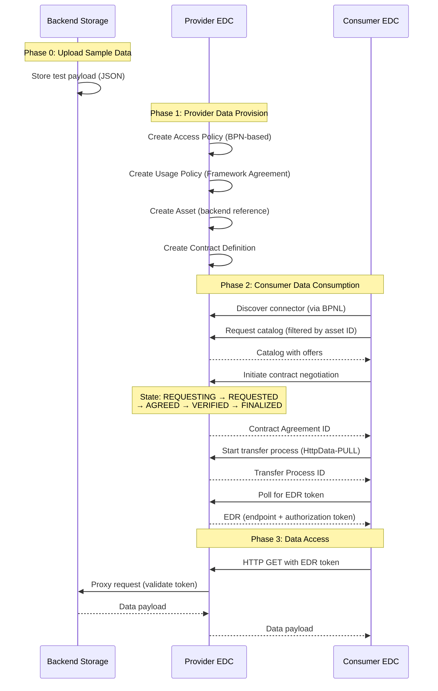

# Tractus-X SDK - Test Compatibility Kit (TCK)

## Overview

The **Test Compatibility Kit (TCK)** provides comprehensive end-to-end (E2E) testing scripts to validate that Eclipse Dataspace Connector (EDC) implementations work correctly with the Tractus-X SDK. These tests verify the complete data exchange flow from provider data provision through consumer data consumption.

The TCK is designed for use with:
- **EDC**: [Eclipse Tractus-X EDC](https://github.com/eclipse-tractusx/tractusx-edc)
- **Backend**: [simple-data-backend](https://github.com/eclipse-tractusx/tractus-x-umbrella/tree/main/simple-data-backend) from Tractus-X Umbrella

The TCK supports both legacy and current EDC protocol versions:
- **Jupiter Protocol**: Legacy DSP (`dataspace-protocol-http`) for EDC v0.8.0–0.10.x
- **Saturn Protocol**: Current DSP 2025-1 (`dataspace-protocol-http:2025-1`) for EDC v0.11.x+

## Purpose

The TCK validates:
✅ **Management API Compatibility**: Asset, Policy, and Contract Definition creation  
✅ **DSP Protocol Compliance**: Catalog requests, contract negotiation, transfer processes  
✅ **ODRL Policy Enforcement**: BPN-based access control, framework agreements, usage policies  
✅ **Verifiable Credentials**: Proper dataspace onboarding and credential validation required for policy compliance  
✅ **EDR Token Flow**: Endpoint Data Reference generation and authenticated data access  
✅ **JSON-LD Context Handling**: Proper semantic web standards across protocol versions  
✅ **SDK Service Layer**: Provider and Consumer service initialization and operations  

> **Note**: These tests require both Provider and Consumer organizations to be properly onboarded in the Catena-X dataspace with valid Verifiable Credentials that satisfy the policy constraints being tested.  

## TCK Test Scripts

The TCK provides **4 test scripts** covering two protocol versions and two complexity levels:

| Script | Protocol | EDC Version | Complexity | Purpose |
|--------|----------|-------------|------------|---------|
| `tck_e2e_saturn_0-11-X_detailed.py` | Saturn (DSP 2025-1) | 0.11.x+ | Detailed | Step-by-step validation of each phase |
| `tck_e2e_saturn_0-11-X_simple.py` | Saturn (DSP 2025-1) | 0.11.x+ | Simple | Single-call validation via `do_get_with_bpnl()` |
| `tck_e2e_jupiter_0-10-X_detailed.py` | Jupiter (Legacy DSP) | 0.8.x–0.10.x | Detailed | Step-by-step validation (legacy protocol) |
| `tck_e2e_jupiter_0-10-X_simple.py` | Jupiter (Legacy DSP) | 0.8.x–0.10.x | Simple | Single-call validation (legacy protocol) |

### Detailed vs. Simple Tests

**Detailed Tests** (`*_detailed.py`):
- Explicit control over each phase (provision, catalog, negotiate, transfer, access)
- Validates individual API responses at each step
- Comprehensive logging of all requests and responses
- Best for: Debugging, learning the flow, verifying specific behaviors

**Simple Tests** (`*_simple.py`):
- Uses SDK's `do_get_with_bpnl()` convenience method
- Entire consumer flow (catalog → negotiate → transfer → EDR → GET) in one call
- Minimal code, maximum automation
- Best for: Quick smoke tests, CI/CD integration, production usage patterns

## Test Flow

All TCK tests follow this standardized flow:



## Configuration

Each TCK script requires configuration for:
1. **Provider EDC Connector**
2. **Consumer EDC Connector**
3. **Backend Data Source** (for storing test data)

### Example Configuration

```python
# Provider EDC Configuration
PROVIDER_CONNECTOR_CONFIG = {
    "base_url": "https://provider-edc.example.com",        # Control Plane URL
    "dma_path": "/management",                             # Management API path
    "api_key_header": "X-Api-Key",                         # API key header name
    "api_key": "your-provider-api-key-here",               # Management API key
    "dataspace_version": "saturn",                         # "jupiter" or "saturn"
    "bpn": "BPNL000000000001",                             # Provider BPN
    "dsp_url": "https://provider-edc.example.com/api/v1/dsp"  # DSP endpoint (no protocol suffix)
}

# Consumer EDC Configuration
CONSUMER_CONNECTOR_CONFIG = {
    "base_url": "https://consumer-edc.example.com",        # Control Plane URL
    "dma_path": "/management",                             # Management API path
    "api_key_header": "X-Api-Key",                         # API key header name
    "api_key": "your-consumer-api-key-here",               # Management API key
    "dataspace_version": "saturn",                         # "jupiter" or "saturn"
    "bpn": "BPNL000000000002"                              # Consumer BPN
}

# Backend Storage Configuration
BACKEND_CONFIG = {
    "base_url": "https://storage.example.com",             # Backend API base URL
    "api_key_header": "X-Api-Key",                         # Optional: API key header name
    "api_key": ""                                          # Optional: API key (leave empty if not needed)
}
```

### Key Configuration Notes

⚠️ **IMPORTANT**:
- **DSP URL**: Do NOT include protocol version suffix (e.g., `/2025-1`). The consumer EDC appends this automatically when needed (the idea is to demonstrate backward compatibility)
- **BPN Format**: Must match the format in your Discovery Service (e.g., `BPNL` prefix for legal entities).
- **API Keys**: Ensure Management API keys have sufficient permissions for create/read operations.
- **Backend Authentication**: If your backend requires authentication, provide the `api_key` and `api_key_header`. If left empty, no authentication headers are sent.

## Running TCK Tests

> **💡 Quick Tips**: 
> - **Debug logging**: Enabled by default. Use `--no-debug` to disable verbose output.
> - **Cleanup**: Enabled by default. Use `--no-cleanup` to preserve resources after test completion.
> - See [Command-Line Options](#command-line-options) for detailed information.

### Prerequisites

1. **Two EDC Connectors** (Provider and Consumer):
   - EDC Implementation: [Eclipse Tractus-X EDC](https://github.com/eclipse-tractusx/tractusx-edc)
   - For Saturn: Version 0.11.x or higher
   - For Jupiter: Version 0.8.0 – 0.10.x
   - Both accessible via HTTP/HTTPS
   - Management API enabled with authentication

2. **Backend Storage Service**:
   - Recommended: [simple-data-backend](https://github.com/eclipse-tractusx/tractus-x-umbrella/tree/main/simple-data-backend) from Tractus-X Umbrella
   - HTTP-accessible endpoint for storing test data
   - Optional API key authentication support
   - Reachable from Provider Data Plane

3. **Network Connectivity**:
   - Your machine → Provider Control Plane (Management API)
   - Your machine → Consumer Control Plane (Management API)
   - Consumer EDC → Provider EDC (DSP protocol endpoint)
   - Provider Data Plane → Backend Storage (data retrieval)

4. **Discovery Service** (Saturn only):
   - BPN-to-connector mapping registered
   - Discovery Finder and BPN Discovery services operational

5. **Dataspace Onboarding and Verifiable Credentials**:
   - Both Provider and Consumer organizations must be onboarded in the Catena-X dataspace
   - Each organization requires valid Verifiable Credentials (VCs) that satisfy the policy constraints
   - **For BPN-based policies**: Organizations must have valid BPN credentials registered with their EDC connectors
   - **For Framework Agreement policies**: Organizations must possess VCs proving membership in the required frameworks (e.g., `Traceability:1.0`)
   - **For other ODRL constraints**: Ensure VCs cover all `leftOperand` values used in your access and usage policies
   - EDC connectors must be configured with credential validation (e.g., SSI integration for VC verification)
   - Without proper credentials, contract negotiations will be rejected even if the catalog is visible

> **Important**: TCK tests assume all credential prerequisites are met. If tests fail during contract negotiation (stuck in `REQUESTING` or `TERMINATED` state), verify that both parties have valid credentials for the policies being tested.

### Step 1: Configure Test Script

Edit the configuration section at the top of your chosen TCK script:

```bash
# For Saturn detailed test
vim tck/connector/tck_e2e_saturn_0-11-X_detailed.py

# Update these sections:
# - PROVIDER_CONNECTOR_CONFIG
# - CONSUMER_CONNECTOR_CONFIG
# - BACKEND_DATA_SOURCE_CONFIG
```

Replace all `PLACEHOLDER` values with your actual environment details.

### Step 2: Run the Test

```bash
# Navigate to TCK directory
cd tck/connector

# Run Saturn detailed test (debug and cleanup enabled by default)
python tck_e2e_saturn_0-11-X_detailed.py

# Run Saturn simple test (debug and cleanup enabled by default)
python tck_e2e_saturn_0-11-X_simple.py

# Run Jupiter detailed test
python tck_e2e_jupiter_0-10-X_detailed.py

# Run Jupiter simple test
python tck_e2e_jupiter_0-10-X_simple.py

# Disable debug logging for cleaner output
python tck_e2e_saturn_0-11-X_detailed.py --no-debug

# Disable cleanup to preserve resources for debugging
python tck_e2e_saturn_0-11-X_detailed.py --no-cleanup

# Disable both debug and cleanup
python tck_e2e_saturn_0-11-X_detailed.py --no-debug --no-cleanup
```

### Command-Line Options

All TCK tests support the following command-line options:

**`--no-debug`**: Disable DEBUG-level logging (**debug enabled by default**)
- By default, all TCK tests run with DEBUG-level logging enabled
- This provides verbose logging for all HTTP requests and responses
- Shows detailed SDK internal operations
- To disable verbose logging and see only INFO-level messages, use `--no-debug`
- Example: `python tck_e2e_saturn_0-11-X_simple.py --no-debug`

**`--no-cleanup`**: Skip resource cleanup after test (**cleanup enabled by default**)
- By default, all TCK tests automatically clean up resources after completion
- Cleanup includes:
  - All EDC provider resources (Contract Definitions, Assets, Policies)
  - Backend test data via HTTP DELETE request
  - Resources deleted in reverse order of creation to maintain referential integrity
  - Cleanup executes in the `finally` block, ensuring it runs even if the test fails
- **Use `--no-cleanup` when**:
  - Debugging failed tests (resources should remain for investigation)
  - Inspecting created resources manually in EDC Management API
  - Running tests in production-like environments where cleanup is handled externally
  - Performing compliance audits that require resource persistence
- **Keep default cleanup when**:
  - Running repeated tests to avoid resource ID conflicts
  - Testing in CI/CD pipelines
  - Development/testing environments with limited cleanup automation
- Example: `python tck_e2e_jupiter_0-10-X_detailed.py --no-cleanup`

> **Note**: When cleanup is enabled (default), the test logs all deletion operations. Successful deletions show `✓ Deleted [ResourceType]: [ResourceID]`. Failed deletions are logged as errors but do not cause the test to fail.

### Step 3: Review Test Results

Test results are logged to timestamped files and console:

```bash
# Log file naming convention:
saturn_e2e_run_2026-02-24_140847_PASS.log
jupiter_simple_e2e_run_2026-02-24_140741_FAIL.log

# View recent test logs
ls -lt *_e2e_run_*.log | head

# Inspect a specific test run
less saturn_e2e_run_2026-02-24_140847_PASS.log

# Search for errors in failed tests
grep -i "error\|exception\|fail" jupiter_e2e_run_*_FAIL.log
```

## Log Output Format

TCK tests produce comprehensive structured logs:

### Successful Run Example

```log
2026-02-24 14:08:47,294 INFO [saturn_e2e] Logging to file: saturn_e2e_run_2026-02-24_140847.log
2026-02-24 14:08:47,425 INFO [saturn_e2e] ✓ Access Policy created: access-policy-bpn-1771938527
2026-02-24 14:08:47,520 INFO [saturn_e2e] ✓ Usage Policy created: usage-policy-framework-1771938527
2026-02-24 14:08:47,559 INFO [saturn_e2e] ✓ Asset created: vehicle-production-data-1771938527
2026-02-24 14:08:47,583 INFO [saturn_e2e] ✓ Contract Definition created: contract-def-1771938527

2026-02-24 14:08:51,583 INFO [saturn_e2e] [CATALOG RESPONSE]:
{
  "@id": "5e19371d-09dd-4616-b442-1f4ee888b052",
  "@type": "Catalog",
  "dataset": [{ ... }]
}

2026-02-24 14:08:55,691 INFO [saturn_e2e] ✓ Contract Agreement finalized: 056c594b-e344-41a0-8cc8-0737592e020b
2026-02-24 14:09:00,064 INFO [saturn_e2e] ✓ EDR received!

╔══════════════════════════════════════════════════════════════════════════════╗
║                              E2E TEST RUN SUMMARY                            ║
╠══════════════════════════════════════════════════════════════════════════════╣
║  STEP                                          RESULT      TIME              ║
║  ──────────────────────────────────────────────────────────────────────────  ║
║  ✓ Phase 0 · Upload sample data to backend       PASS      0.1s              ║
║  ✓ Phase 1 · Provider data provision             PASS      0.2s              ║
║  ✓ Phase 2 · Consumer data consumption           PASS      9.5s              ║
║  ✓ Phase 3 · Access data with EDR                PASS      0.4s              ║
╠══════════════════════════════════════════════════════════════════════════════╣
║  RESULT: PASS  |  4 passed  0 failed  0 skipped  |  Total: 13.2s             ║
╚══════════════════════════════════════════════════════════════════════════════╝
```

### Structured Logging Markers

TCK tests log all HTTP requests and responses with structured markers:

- `[UPLOAD REQUEST]` / `[UPLOAD RESPONSE]`: Backend data upload
- `[CATALOG RESPONSE]`: Provider catalog with datasets and offers
- `[NEGOTIATION REQUEST]` / `[NEGOTIATION RESPONSE]`: Contract negotiation initiation
- `[NEGOTIATION STATE RESPONSE]`: Negotiation state polling
- `[TRANSFER REQUEST]` / `[TRANSFER RESPONSE]`: Transfer process initiation
- `[EDR RESPONSE]`: Endpoint Data Reference (token + endpoint)
- `[DATA RESPONSE]`: Final data payload retrieved from backend

## Interpreting Test Results

### PASS Criteria

A test is marked **PASS** when all phases complete successfully:
- ✅ Phase 0: Sample data uploaded to backend (HTTP 200)
- ✅ Phase 1: All provider resources created (policies, asset, contract definition)
- ✅ Phase 2: Consumer successfully negotiates and obtains EDR
- ✅ Phase 3: Data retrieved using EDR matches uploaded payload

### FAIL Indicators

Common failure points:

**Phase 0 Failures** (Backend Upload):
```
HTTPError: 401 Unauthorized
→ Check backend API key if authentication is required

HTTPError: 404 Not Found
→ Verify backend API base URL is correct
```

**Phase 1 Failures** (Provider Provision):
```
HTTPError: 401 Unauthorized
→ Verify Provider API key is correct

HTTPError: 409 Conflict
→ Resource ID already exists (change timestamp seed or clean up)
```

**Phase 2 Failures** (Consumer Consumption):
```
Asset not found in catalog
→ Wait longer after creating contract definition (try 5+ seconds)
→ Verify Consumer BPN is in Provider's access policy
→ Check catalog filtering (asset ID, DCT type) is correct

Contract negotiation timeout (state stuck in REQUESTING)
→ Verify Consumer can reach Provider DSP endpoint
→ Check Provider logs for negotiation errors
→ Verify ODRL context URLs match EDC version
→ Verify Consumer has valid Verifiable Credentials for the policy constraints
→ Check that both parties are properly onboarded in the dataspace

Contract negotiation TERMINATED by provider
→ Consumer lacks required Verifiable Credentials (e.g., BPN credential, Framework Agreement membership)
→ Policy constraints not satisfied (check VC claims match policy leftOperand values)
→ SSI/credential verification failed on Provider side
→ Check Provider EDC logs for credential validation errors

EDR not available after transfer (state stuck in REQUESTED)
→ Check Provider Data Plane is running
→ Verify backend URL is reachable from Provider Data Plane
→ Check backend authentication if required
```

**Phase 3 Failures** (Data Access):
```
HTTPError: 401 Unauthorized
→ EDR token expired (re-run from Phase 2)
→ Token format incorrect (check "authorization" field in EDR)

HTTPError: 403 Forbidden
→ Token validation failed on Provider side
→ Check Provider Data Plane token validation settings

HTTPError: 502 Bad Gateway
→ Provider Data Plane cannot reach backend
→ Check backend URL and authentication configuration
```

## Validation Checklist

Use this checklist to debug TCK failures:

### Provider Configuration
- [ ] Management API accessible from test machine
- [ ] API key valid and has create permissions
- [ ] BPN format matches Discovery Service registration
- [ ] DSP URL does NOT include protocol version suffix

### Consumer Configuration
- [ ] Management API accessible from test machine
- [ ] API key valid and has create permissions
- [ ] BPN registered in Discovery Service (Saturn only)
- [ ] Can reach Provider DSP endpoint over network

### Backend Configuration
- [ ] Storage API accessible from test machine
- [ ] Backend API key valid if authentication is required
- [ ] Backend accepts requests from Provider Data Plane

### Network Connectivity
- [ ] Test machine → Provider Control Plane (HTTPS)
- [ ] Test machine → Consumer Control Plane (HTTPS)
- [ ] Consumer EDC → Provider DSP endpoint (HTTPS)
- [ ] Provider Data Plane → Backend Storage (HTTPS)

### Dataspace Onboarding & Credentials
- [ ] Provider organization onboarded in Catena-X dataspace
- [ ] Consumer organization onboarded in Catena-X dataspace
- [ ] Provider has valid BPN Verifiable Credential
- [ ] Consumer has valid BPN Verifiable Credential
- [ ] Consumer has required Framework Agreement VCs (e.g., Traceability:1.0)
- [ ] All VCs contain claims matching policy constraints (leftOperand values)
- [ ] EDC connectors configured with SSI/credential validation
- [ ] Credential issuers are trusted by both parties

### Protocol Compatibility
- [ ] EDC versions match protocol (Jupiter: 0.8.x–0.10.x, Saturn: 0.11.x+)
- [ ] ODRL context URLs match EDC version
- [ ] DSP protocol string matches (Jupiter: no version suffix, Saturn: `:2025-1`)

## Advanced Usage

### Custom Test Data

Modify the `SAMPLE_ASPECT_MODEL` in the test script to use your own data:

```python
SAMPLE_ASPECT_MODEL = {
    "yourModel": "yourData",
    "customField": 12345,
    # ... your JSON payload
}
```

### Custom Policies

The TCK demonstrates common policy patterns. To test custom policies:

```python
# In provision_data_on_provider() function:
access_policy = provider_service.create_policy(
    policy_id=f"custom-policy-{timestamp}",
    permissions=[{
        "action": "access",
        "constraint": {
            "leftOperand": "BusinessPartnerNumber",
            "operator": "eq",
            "rightOperand": "your-value"
        }
    }]
)
```

### Parallel Test Execution

Run multiple TCK tests in parallel for regression testing:

```bash
# Run all Saturn tests in parallel
python tck_e2e_saturn_0-11-X_detailed.py &
python tck_e2e_saturn_0-11-X_simple.py &
wait

# Check results
grep "RESULT:" saturn_*_PASS.log saturn_*_FAIL.log
```

### CI/CD Integration

Example GitHub Actions workflow:

```yaml
name: TCK Tests
on: [push, pull_request]

jobs:
  tck-saturn:
    runs-on: ubuntu-latest
    steps:
      - uses: actions/checkout@v3
      - uses: actions/setup-python@v4
        with:
          python-version: '3.11'
      - run: pip install -e .
      - name: Run Saturn TCK
        env:
          PROVIDER_API_KEY: ${{ secrets.PROVIDER_API_KEY }}
          CONSUMER_API_KEY: ${{ secrets.CONSUMER_API_KEY }}
        run: |
          cd tck/connector
          python tck_e2e_saturn_0-11-X_simple.py
      - name: Upload logs
        if: always()
        uses: actions/upload-artifact@v3
        with:
          name: tck-logs
          path: tck/connector/*_e2e_run_*.log
```

## Protocol Differences

### Jupiter vs. Saturn

| Aspect | Jupiter (0.8.x–0.10.x) | Saturn (0.11.x+) |
|--------|------------------------|------------------|
| **DSP Protocol** | `dataspace-protocol-http` | `dataspace-protocol-http:2025-1` |
| **ODRL Context** | `https://w3id.org/tractusx/auth/v1.0.0`<br>`http://www.w3.org/ns/odrl.jsonld` | `https://w3id.org/catenax/2025/9/policy/odrl.jsonld`<br>`https://w3id.org/catenax/2025/9/policy/context.jsonld` |
| **Catalog Keys** | `dcat:dataset`, `odrl:hasPolicy` (prefixed) | `dataset`, `hasPolicy` (unprefixed, or both) |
| **BPN Usage** | Direct BPNL as `counter_party_id` | DID via Discovery Service |
| **Discovery** | Not required (BPNL → DSP URL mapping manual) | Required (BPNL → DID → DSP URL) |

### Selecting the Right Protocol

- **Use Jupiter TCK** if testing EDC v0.8.x–0.10.x deployments
- **Use Saturn TCK** if testing EDC v0.11.x+ deployments
- **Run both** to ensure backward compatibility during migration

## Troubleshooting Common Issues

### SSL Certificate Verification Errors

```python
ssl.SSLCertVerificationError: certificate verify failed
```

**Solution**: Tests include `verify=False` for self-signed certificates in test environments. For production:
```python
# Pass custom CA bundle
consumer_service.get_catalog_by_asset_id_with_bpnl(..., verify="/path/to/ca-bundle.crt")
```

### JSON-LD Context Mismatches

```
KeyError: 'dcat:dataset'  # or  KeyError: 'dataset'
```

**Solution**: TCK handles both prefixed and unprefixed keys. If you encounter this, check your EDC version matches the protocol:
- Jupiter: Expects prefixed keys (`dcat:dataset`, `odrl:hasPolicy`)
- Saturn: May use unprefixed or prefixed keys (SDK handles both)

### Transfer Process Stuck in REQUESTED

```
Transfer state: REQUESTED (polling timeout)
```

**Solution**:
1. Check Provider Data Plane logs for backend connection errors
2. Verify backend API key is valid if authentication is required
3. Test backend URL accessibility from Data Plane network:
   ```bash
   curl -v https://backend.example.com/api/data
   ```

### Discovery Service Not Found (Saturn)

```
HTTPError: 404 Not Found (Discovery Finder)
```

**Solution**: Saturn requires BPN-to-connector mapping in Discovery Service:
1. Verify Discovery Finder URL is correct
2. Register Provider BPN in Discovery Service
3. Check BPN format (must match exactly, including prefix)

## Documentation References

- **Tractus-X EDC Documentation**: [Management API Walkthrough](https://github.com/eclipse-tractusx/tractusx-edc/tree/main/docs/usage/management-api-walkthrough)
- **SDK API Reference**: [Connector Services](../../docs/api-reference/dataspace-library/connector/)
- **Industry Core Hub**: [Reference Implementation](https://github.com/eclipse-tractusx/industry-core-hub)
- **DSP Specification**:
  - [Dataspace Protocol 2024-1 or 0.8](https://docs.internationaldataspaces.org/ids-knowledgebase/v/dataspace-protocol)
  - [Dataspace Protocol 2025-1](https://eclipse-dataspace-protocol-base.github.io/DataspaceProtocol/2025-1/)

## Support

For issues or questions:
- **Bug Reports**: [Open an issue](https://github.com/eclipse-tractusx/tractusx-sdk/issues)
- **SDK Documentation**: [Tractus-X SDK Docs](../../docs/)
- **Community**: Tractus-X Mailing List and Matrix channels
